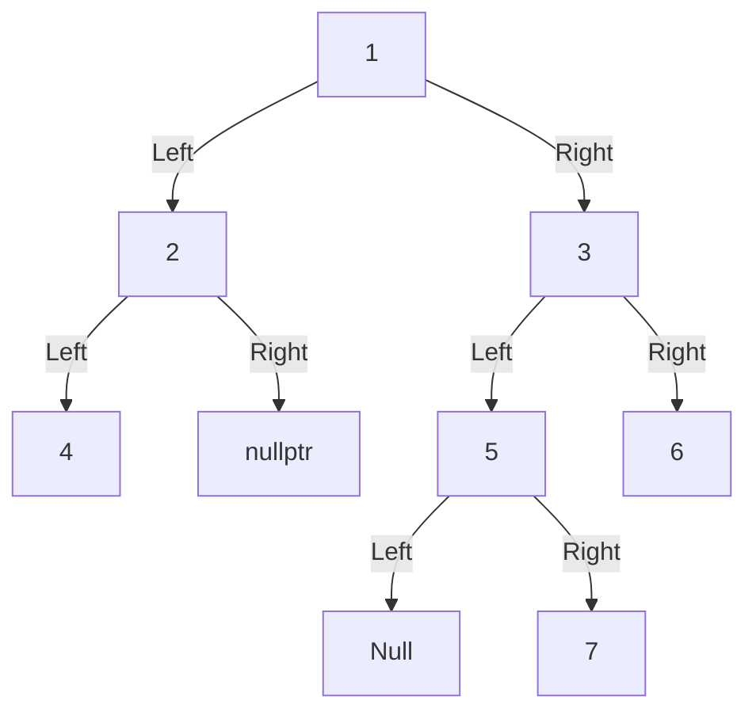

### Binary Tree

```mermaid
graph TD;
  1-->|Left|2;
  1-->|Right|3;
  
  2-->|Left|4;
  2-->|Right|nullptr;
  
  3-->|Left|5;
  3-->|Right|6;
  
  5-->|Left|Null;
  5-->|Right|7;
  
  
```
---
### Preorder

```mermaid
graph LR;
  1-->2-->4-->3-->5-->7-->6;
```
---
### Inorder

```mermaid
graph LR;
  4-->2-->1-->5-->7-->3-->6;
```
---
### Postorder

```mermaid
graph LR;
  4-->2-->7-->5-->6-->3-->1;
```
