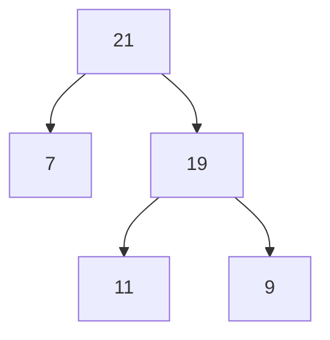
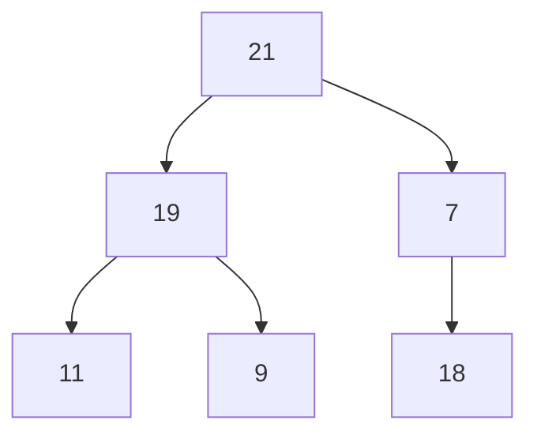
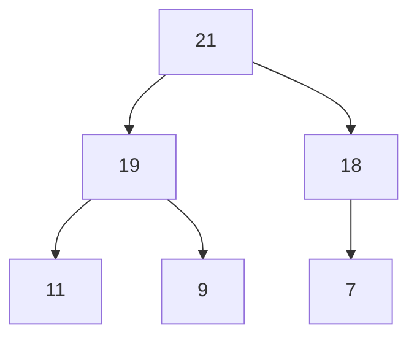

# Priority Queue (max heap)
## 2 rules
- 1. Parent node should be bigger than its child node
- 2. Maintain Complete binary tree
---
### Push
- current status

- insert 18 (initial)

- Follow rule no.1

