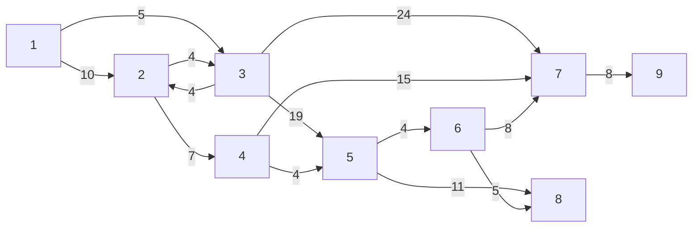

```mermaid
graph LR;
  1--> |10|2;
  1--> |5|3;
  2--> |4|3;
  2--> |7|4;
  3--> |4|2;
  3--> |19|5;
  3--> |24|7;
  4--> |4|5;
  4--> |15|7;
  5--> |4|6;
  5--> |11|8;
  6--> |8|7;
  6--> |5|8;
  7--> |8|9;
```  
---
## Shorest time from A ~ B
---
#### node 1 ~ node 2 : 9

```mermaid
graph LR;
  1--> |5|3;
  3--> |4|2;
```
---
#### node 2 ~ node 9: 30

```mermaid
graph LR;
  2--> |7|4;
  4--> |15|7;
  7--> |8|9;
```
---
#### node 3 ~ node 8: 24

```mermaid
graph LR;
  3--> |4|2;
  2--> |7|4;
  4--> |4|5;
  5--> |4|6;
  6--> |5|8;
```
  
