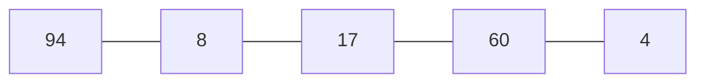

# Insertion Sort
- Key (the number to be inserted) is list[i] (starts from 1)

- 0 ~ i-1 numbers are considered sorted 

- j iteration searches in reverse order from ith index

- if list[j] is bigger than the key, move list[j] to list[j+1]

- after j iteration ends, copy the key value to list[j]
---

---
## i = 1 , key = list[1] = 8
- j = 0
- list[j] > key, list[j+1] = list[j]
```mermaid
   graph LR;
   8---94;
   94---17;
   17---60;
   60---4;
 ```
---
## i = 2 , key = list[2] = 17
- j = 1, list[j] = 94
- list[j] > key, list[j+1] = list[j]
```mermaid
   graph LR;
   8---17;
   17---94;
   94---60;
   60---4;
 ```
 - j = 0, list[j] = 8
 - list[j] < key, break
```mermaid
   graph LR;
   8---17;
   17---94;
   94---60;
   60---4;
 ```
 ---
 ## i = 3 , key = list[i] = 60
 - j = 2, list[j] = 94
 - list[j] > key, list[j+1] = list[j]
 
 ```mermaid
   graph LR;
   8---17;
   17---60;
   60---94;
   94---4;
 ```
 - j = 1, list[j] = 17
 - list[j] < key, break
 
  ```mermaid
   graph LR;
   8---17;
   17---60;
   60---94;
   94---4;
 ```
 ---
 ## i = 4 , key = list[i] = 4
 
 - j = 3, list[j] = 94
 - list[j] > key, list[j+1] = list[j]

 ```mermaid
   graph LR;
   8---17;
   17---60;
   60---4;
   4---94;
 ```
 
- j = 2, list[j] = 60
- list[j] > key, list[j+1] = list[j]

```mermaid
   graph LR;
   8---17;
   17---4;
   4---60;
   60---94;
 ```
 
- j = 1, list[j] = 17
- list[j] > key, list[j+1] = list[j]

```mermaid
   graph LR;
   8---4;
   4---17;
   17---60;
   60---94;
 ```
 
 - j = 0, list[j] = 8
 - list[j] > key, list[j+1] = list[j]

```mermaid
   graph LR;
   4---8;
   8---17;
   17---60;
   60---94;
 ```
