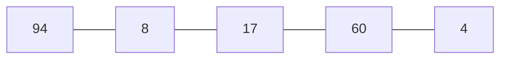

# Insertion Sort
- Key (the number to be inserted) is list[i] (starts from 1)

- 0 ~ i-1 numbers are considered sorted 

- j iteration searches in reverse order from ith index

- if list[j] is bigger than the key, move list[j] to list[j+1]

- after j iteration ends, copy the key value to list[j]
---

---
## i = 1 , key = list[1]
- j = 0
- list[j] > key, list[j+1] = list[j]
```mermaid
   graph LR;
   94---94;
   94---17;
   17---60;
   60---4;
   ```
