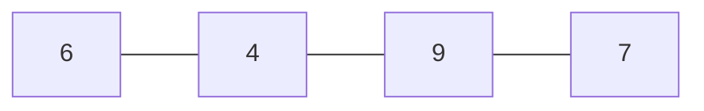
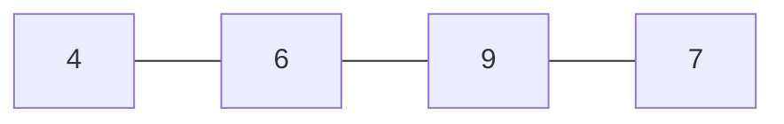
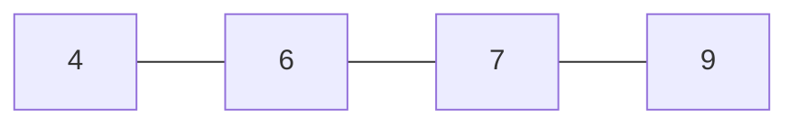

# Selection Sort
- left list and right list exist
- in the initial state, the left list is empty; 
- a repitition of the task of "selecting" the smallest number on the right list and moving it to the left-foot list

- 0 ~ 'i' indicates the left list
- 'j' indicates the right list
---

---
### i = 0
#### leastNumber = list[0] = 6
|j|leastIdx|leastNumber|
|---|-----|----|
|1|0 -> 1|4|
|2|No change|4|
|3|No change|4|

- swap(list[0], list[1])

---
### i = 1
#### leastNumber = list[1] =6
|j|leastIdx|least number|
|---|-----|----|
|2|No change|6|
|3|No change|6|

- no swap

---
### i = 2
#### leastNumber = list[2] = 9
|j|leastIdx|least number|
|---|-----|----|
|3|2 -> 3|7|

- swap(list[2], list[3])

